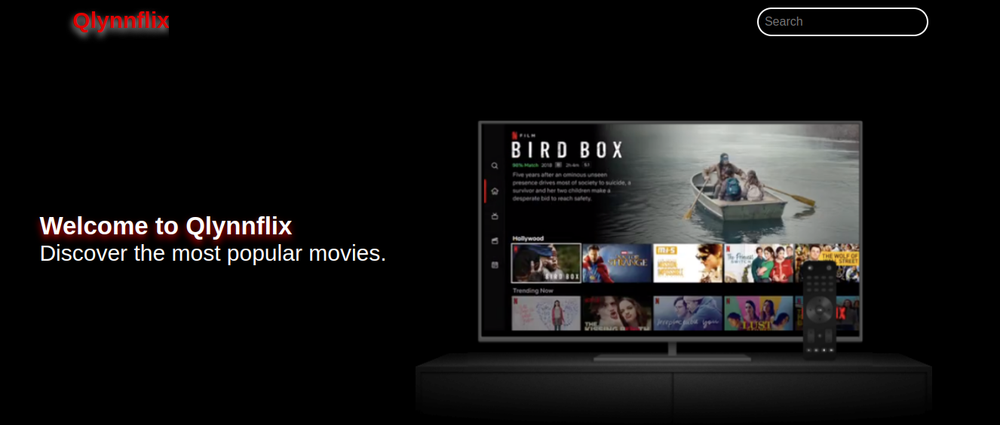

# Phase 1 Project

### Author
- Jackline Adhiambo

## Learning Goals

- Design and architect features across a frontend
- Communicate and collaborate in a technical environment
- Integrate JavaScript and an external API
- Debug issues in small- to medium-sized projects
- Build and iterate on a project MVP

## Introduction

This is a Single Page Application project(**SPA**).
The frontend will be built with HTML, CSS, and JavaScript and will communicate with a public API.

### Project Requirements

1. The app must be a HTML/CSS/JS frontend that accesses data from a public API.
  All interactions between the client and the API should be handled
  asynchronously and use JSON as the communication format.

2. The entire app must run on a single page. There should be NO redirects. In
   other words, your project will contain a single HTML file.

3. The app needs to incorporate at least 3 separate event listeners
   (DOMContentLoaded, click, change, submit, etc).

4. Some interactivity is required. This could be as simple as adding a "like"
   button or adding comments. These interactions do not need to persist after
   reloading the page.

### Stretch Goals

- Use [json-server][] in your project to persist your app's interactivity.

### MVP ASAP

- Build a Minimum Viable Product (MVP) as quickly as possible.
  - Pick an API and explore it early on to ensure it will work for your need

### JSON Server Instructions

> **Note**: Using `json-server` is a stretch goal, so make sure you have a
> working MVP before trying to set up `json-server`!

### Qlynnflix
- This is a movie application that displays movies and allows a user to search, comment and like a movie.

### Image
#### Header

#### Items

